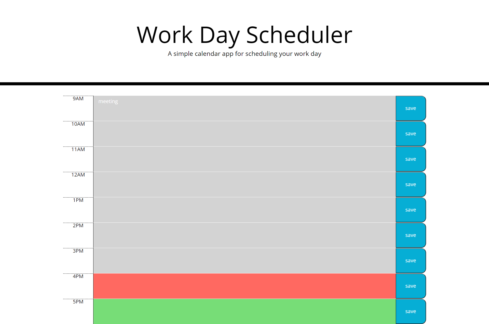

# Application Does:
* WorkDayScheduler

# Technologies used:
* HTML, CSS, JavaScript,JQuery

# Features:

* Show current date when open the day planner
* Presented with time blocks for standars office hours
* time blocks presented with colors indicating past,present and future
* Enter the data by clicling time block
* Data saves in local storage
* Saved data persists even after refresh

# Challenges:
* optimistic code
* this keyword

# Sample web page

# Github Page 
https://vsatyakavya.github.io/WorkDayScheduler.github.io/.

# Github Repository
https://github.com/vsatyakavya/WorkDayScheduler.github.io

@copyright 2020
